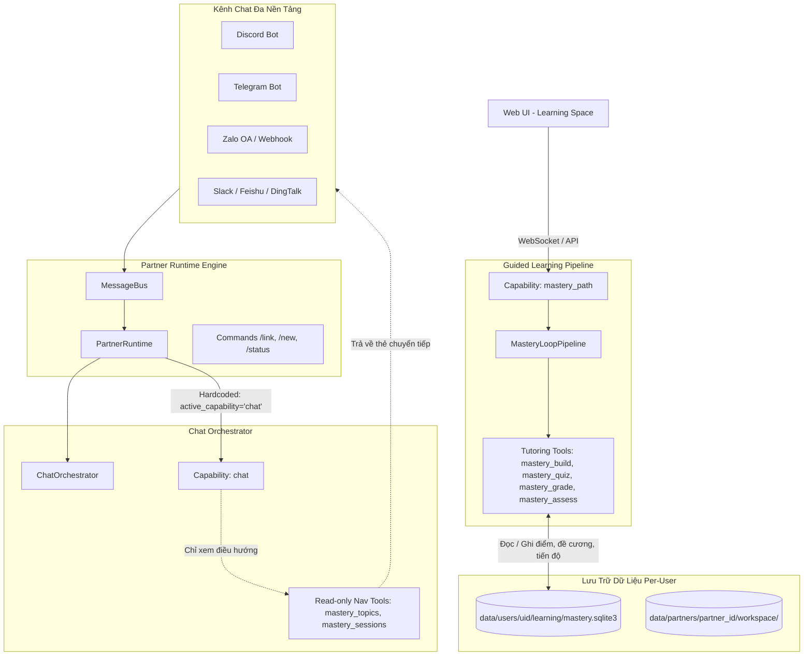
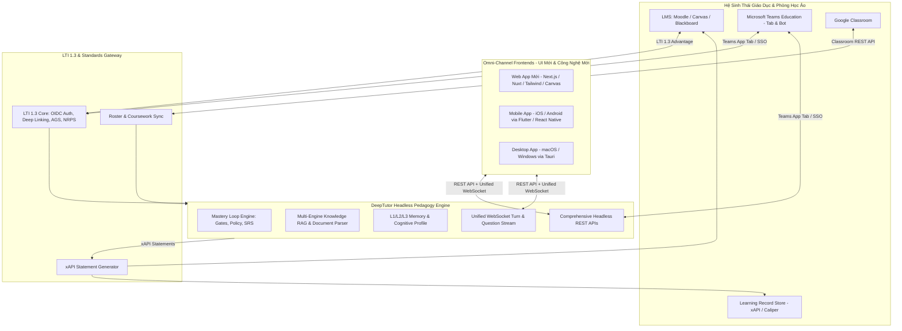

# Phân Tích Hiện Trạng & Khoảng Trống Trải Nghiệm Người Dùng (GAP Analysis)
## Tính Năng Guided Learning (Mastery Path) & Hệ Thống Kênh Chat (Partners)

---

## 1. Tổng Quan Kiến Trúc & Hiện Trạng (Current State)

DeepTutor áp dụng kiến trúc **Agent-Native** hai tầng:
- **Tầng 1 (Tools):** Các công cụ đơn lẻ mà LLM tự lựa chọn (`web_search`, `read_source`, `rag`, `write_memory`,...).
- **Tầng 2 (Capabilities):** Các pipeline chuyên biệt chiếm quyền kiểm soát toàn bộ lượt tương tác (`chat`, `mastery_path`, `deep_solve`, `deep_research`, `visualize`,...).

Trong đó, trải nghiệm học tập có hướng dẫn (**Mastery Path / Guided Learning**) và hệ thống bạn đồng hành đa kênh (**Partners / IM Channels**) hoạt động theo các cơ chế cụ thể sau:

---

### 1.1. Luồng hoạt động của Mastery Path trên Web UI
1. **Khởi tạo chủ đề (Topic Intake):** Người dùng nhập Mục tiêu học tập (*Goal*) và chọn tài liệu đính kèm (*Sources* từ Book, Knowledge Base). Hệ thống gọi API `POST /api/mastery-paths/topics`.
2. **Giai đoạn chưa có đề cương (`modules: []`):** Server tạo bản ghi Topic với danh sách bài học rỗng. Tên chủ đề được tự động sinh bằng cách cắt chuỗi mục tiêu (tối đa 32 ký tự) hoặc qua LLM. Trạng thái hiển thị trên Web là **"No outline yet"** (`needsRouteRepair = true`).
3. **Phiên thiết kế đề cương (Outline Session):** Người dùng bấm *"Design the outline with the tutor"*, hệ thống mở một phiên chat đặc biệt chạy capability `mastery_path` ở chế độ `OUTLINE`. AI gia sư đọc tài liệu, phỏng vấn nhu cầu và gọi tool `mastery_build` để sinh và lưu các Module + Knowledge Points vào SQLite.
4. **Vòng lặp học tập & Cổng kiến thức (Study Loop & Knowledge Gates):**
   - **Probe:** Câu hỏi khảo sát ban đầu xem người học đã biết chưa.
   - **Practice:** Bài tập củng cố, câu hỏi trắc nghiệm có giải thích.
   - **Assess:** Đánh giá định tính yêu cầu người học tự diễn đạt khái niệm.
   - **Review:** Hàng đợi ôn tập ngắt quãng (Spaced Repetition) tự động đẩy các điểm kiến thức cần ôn tập lại.

---

### 1.2. Luồng hoạt động của Partner trên Kênh Chat (Discord, Telegram, Zalo,...)
1. **Ràng buộc Capability:** Toàn bộ tin nhắn đến từ IM đều đi qua `PartnerRuntime` (`deeptutor/services/partners/runtime.py`) với `active_capability="chat"` được gán cố định.
2. **Giới hạn công cụ:** Capability `chat` chỉ được nạp 4 công cụ điều hướng chỉ đọc:
   - `mastery_topics`: Liệt kê các chủ đề đang học và tiến độ.
   - `mastery_sessions`: Xem các phiên trò chuyện của một chủ đề.
   - `mastery_open_session`: Tạo thẻ mở lại một phiên học cũ.
   - `mastery_new_session`: Tạo thẻ mở phiên học mới trên Web.
3. **Không ghi nhận vào Database:** Khi người dùng yêu cầu bot trên Discord/Telegram/Zalo lập lộ trình, AI chỉ đóng vai trò trò chuyện tự nhiên (trả về văn bản Markdown thông thường). Hệ thống **không** kích hoạt `mastery_build`, không tạo Topic ID và không ghi nhận dữ liệu vào `mastery.sqlite3`.

---

### 1.3. Cơ chế Lưu trữ & Đa người dùng (Multi-User)
- **Kiến trúc Per-User Workspace Isolation:** Mỗi người dùng có một thư mục riêng biệt tại `data/users/<uid>/`, trong đó cơ sở dữ liệu `mastery.sqlite3` được cô lập hoàn toàn.
- **Liên kết tài khoản qua lệnh `/link`:** Người dùng chat trên IM ban đầu chỉ mang định danh kênh (`sender_id`). Để bot nhận diện đúng kho tài liệu và lộ trình cá nhân, người học phải thực hiện gõ lệnh `/link <mã_từ_web>`.
- **Thiếu cơ chế phân phối hàng loạt:** Hệ thống chưa có giao diện cho phép Giáo viên/Admin "giao" hoặc "đẩy" (Push/Assign) một Mastery Path mẫu cho nhiều tài khoản học viên cùng lúc; hiện chỉ có thể thực hiện thông qua script gọi REST API backend.

---

## 2. Điểm Tốt (Strengths)

1. **Phương pháp luận Sư phạm Vững chắc (Rigorous Pedagogy):**
   - Thuật toán tính độ thông thạo (`deeptutor/learning/mastery.py`) áp dụng trọng số thời gian (Recency Weights) và giới hạn trần tin cậy (Confidence Cap), ngăn chặn tình trạng trả lời đúng do may mắn.
   - Cơ chế cổng kiến thức phân biệt rõ 4 loại mục tiêu: *Memory (sự thật/ghi nhớ)*, *Concept (khái niệm)*, *Procedure (quy trình/kỹ năng)* và *Design (phán đoán mở)*.
   - Tích hợp sẵn chu kỳ ôn tập ngắt quãng (Spaced Repetition) với hàng đợi `review_queue` lưu thời điểm đến hạn (`due_at`).
2. **Tách biệt Trí tuệ LLM và Luật Sư phạm Cố định:**
   - LLM đảm nhận việc diễn giải tài liệu, sinh câu hỏi và gợi mở giải thích.
   - Việc quyết định học viên có vượt qua cổng kiến thức hay không được kiểm soát bởi code logic tất định (`learning/policy.py`), loại bỏ rủi ro ảo giác tự cho điểm của mô hình ngôn ngữ.
3. **Kiến trúc Kênh Chat (Partners) Mở Rộng Xuất Sắc:**
   - Hỗ trợ hơn 15 nền tảng IM (Discord, Telegram, Slack, Feishu, Zalo, DingTalk, Mattermost, Matrix,...).
   - Tích hợp sẵn bộ nhớ quan hệ (Relationship Memory) và nhận dạng giọng nói tự động (Groq Whisper) cho tin nhắn thoại.
4. **Bảo Mật & Khả Năng Khóa Xung Đột (Lease Management):**
   - Đảm bảo tính toàn vẹn dữ liệu thông qua cơ chế độc quyền ghi `_exclusive_path_mutation` và khóa `PathLease`, tránh việc nhiều phiên học đồng thời làm sai lệch tiến độ.

---

## 3. Khoảng Trống & Điểm Chưa Tốt (Weaknesses & UX Gaps)

### 3.1. Đứt Gãy Trải Nghiệm Đa Kênh (Omnichannel Disconnection)
| Khoảng trống (Gap) | Hiện trạng mã nguồn | Tác động tới Người học |
| :--- | :--- | :--- |
| **Không thể học Mastery Path trực tiếp trên IM** | `PartnerRuntime` ghim cứng `active_capability="chat"`. Không nạp `mastery_build`, `mastery_quiz`, `mastery_grade`. | Người học trên Discord/Telegram/Zalo bị giới hạn ở mức "nói chuyện phiếm". Khi muốn học nghiêm túc có kiểm tra đánh giá, họ bắt buộc phải rời ứng dụng chat để mở trình duyệt Web. |
| **Yêu cầu tạo lộ trình trên IM bị "rơi vào hư vô"** | Bot chỉ sinh ra text Markdown trong cửa sổ chat, không thể lưu vào `mastery.sqlite3`. | Người học tưởng rằng bot đã thiết lập lộ trình cho mình, nhưng khi vào Web kiểm tra thì hoàn toàn không thấy lộ trình đó. |
| **Thẻ chuyển tiếp (Handoff Card) kém thân thiện trên IM** | Metadata `mastery_handoff` được thiết kế cho Web component; trên IM chỉ hiển thị dạng link text dài hoặc text hướng dẫn đơn thuần. | Tỷ lệ chuyển đổi người học từ kênh Chat sang Web UI bị sụt giảm do thao tác chuyển đổi rời rạc. |

### 3.2. Trở Ngại Trên Giao Diện Web (Web UI Friction)
| Khoảng trống (Gap) | Hiện trạng mã nguồn | Tác động tới Người học |
| :--- | :--- | :--- |
| **Tên chủ đề bị cắt cụt, khó hiểu** | `CreateTopicWizard.tsx` bỏ ô nhập Tên; server dùng `_provisional_name` (cắt tối đa 32 ký tự câu đầu của Goal) hoặc `suggest_topic_name`. | Danh sách lộ trình xuất hiện các tiêu đề dang dở như: *"Tôi muốn học lập trình bất đồng bộ..."*, gây cảm giác sản phẩm chưa hoàn thiện. |
| **Đề cương ban đầu trống rỗng gây hoang mang** | Triết lý thiết kế mới tạo Topic với `modules: []`, giao diện rơi vào trạng thái `needsRouteRepair = true` ("No outline yet"). | Người mới dùng không hiểu tại sao đã bấm "Tạo lộ trình" mà không thấy bài học nào, dễ lầm tưởng hệ thống bị lỗi API hoặc lỗi sinh dữ liệu. |
| **Thiếu Onboarding giải thích các khái niệm sư phạm** | Các thuật ngữ như *Probe*, *Practice*, *Assess*, *Gate*, *Beacon* xuất hiện trên giao diện mà không có giải thích ngữ cảnh. | Người học không hiểu rõ vì sao trả lời đúng một câu mà thanh tiến độ chưa đầy (do cơ chế Confidence Cap và bài đánh giá định tính). |

### 3.3. Rào Cản Quản Trị & Đa Người Dùng (Multi-User & Administration Gaps)
| Khoảng trống (Gap) | Hiện trạng mã nguồn | Tác động tới Người học / Quản trị viên |
| :--- | :--- | :--- |
| **Thiếu chức năng Giao Lộ Trình (Course Assignment)** | Không có API hoặc UI để Admin nhân bản (Clone) một Mastery Path mẫu sang nhiều workspace của học viên. | Giảng viên, trung tâm đào tạo không thể triển khai một chương trình học chung cho 50 hay 100 học viên một cách thuận tiện. |
| **Quy trình kết nối tài khoản (`/link`) bị động** | Bot không tự động phát hiện và mời gọi người dùng liên kết tài khoản khi họ tương tác lần đầu trên Telegram/Zalo. | Dữ liệu học tập bị phân mảnh: hội thoại trên IM nằm ở workspace của Partner, trong khi tài liệu và lộ trình nằm ở workspace của User trên Web. |

---

## 4. Định Hướng Chiến Lược Mới: DeepTutor Là Headless Pedagogy Engine Cho LXP

Thay vì tiêu tốn nguồn lực tùy biến riêng lẻ cho từng nền tảng Chat IM (Telegram/Discord/Zalo buttons - vốn dễ bị phân mảnh và hạn chế khả năng hiển thị sư phạm sâu), hệ thống được định hướng chuyển dịch thành **Headless Pedagogy & Tutoring Engine (Lõi Trí Tuệ Sư Phạm)** phục vụ hệ sinh thái **LXP (Learning Experience Platform)** hiện đại.

---

## 5. Bản Đặc Tả Bộ API Cho Ứng Dụng Học Tập Omni-Channel & LMS

### 5.1. Nhóm API Quản Lý Vòng Đời Lộ Trình Học (Mastery Path Lifecycle APIs)

Bộ API này phục vụ toàn bộ các client (Web mới, Mobile App, Desktop App):

1. **Khởi tạo & Lập đề cương (Intake & Outline):**
   - `POST /api/v2/mastery/topics`: Tạo topic mới với mục tiêu rõ ràng (`goal`), tên chủ đề (`name`), emoji và tài liệu đính kèm (`sources`).
   - `POST /api/v2/mastery/topics/draft`: Sinh trước bản nháp đề cương (draft outline) để xem trước ngay trên giao diện trước khi cam kết.
   - `PUT /api/v2/mastery/topics/{topic_id}/outline`: Cập nhật cấu trúc Modules & Knowledge Points (hỗ trợ kéo thả, sắp xếp lại thứ tự bài học).

2. **Truy vấn trạng thái & Bản đồ tri thức (Map & Board Projection):**
   - `GET /api/v2/mastery/topics/{topic_id}/map`: Lấy cấu trúc cây tri thức (Tree view / Outline view) kèm trạng thái thông thạo từng điểm: `not_started`, `learning`, `mastered`.
   - `GET /api/v2/mastery/topics/{topic_id}/board`: Lấy dữ liệu dạng thẻ Kanban / Grid 2 chiều (tọa độ cột bài học, hàng điểm kiến thức) để vẽ giao diện trực quan.
   - `GET /api/v2/mastery/topics/{topic_id}/reviews`: Lấy danh sách câu hỏi / điểm kiến thức đến hạn ôn tập ngắt quãng (Spaced Repetition due).

3. **Thực thi vòng lặp học tập thời gian thực (Real-time Learning Session over WebSocket):**
   - Endpoint: `/ws/v2/mastery/session`
   - **Giao thức 2 chiều (Bidirectional Protocol):**
     - Client $\rightarrow$ Server:
       - `start_session`: Bắt đầu học một module/điểm kiến thức cụ thể.
       - `submit_answer`: Gửi câu trả lời trắc nghiệm (`choice_index`) hoặc tự luận (`text`).
       - `request_hint`: Yêu cầu gia sư gợi ý khi gặp câu hỏi khó.
       - `interrupt`: Tạm dừng lượt giảng bài của gia sư.
     - Server $\rightarrow$ Client:
       - `event:content`: Stream lời giảng giải, giải thích của gia sư (Markdown/LaTeX math).
       - `event:question_card`: Gửi payload câu hỏi trắc nghiệm/tự luận tương tác (chứa các phương án gây nhiễu distractor).
       - `event:grade_result`: Kết quả chấm điểm (Đúng/Sai, giải thích chi tiết, mức độ thông thạo mới).
       - `event:gate_transition`: Thông báo vượt qua cổng kiến thức (Level-up celebration signal).

---

### 5.2. Nhóm API Tích Hợp LMS (Moodle, Canvas) Qua Chuẩn Quốc Tế

1. **Chuẩn LTI 1.3 Advantage (Learning Tools Interoperability):**
   - **LTI Core & OIDC Launch:** `POST /api/v2/lti/launch`  
     Cho phép nhúng phòng học DeepTutor vào Moodle / Canvas như một hoạt động khóa học (Course Activity) với cơ chế Single Sign-On (SSO). Học viên không cần đăng ký tài khoản riêng; DeepTutor tự nhận diện `user_id`, `course_id`, và vai trò `Learner` / `Instructor`.
   - **LTI Deep Linking:** `POST /api/v2/lti/deep-linking`  
     Giúp giáo viên ngay trong Moodle có thể duyệt danh sách các Mastery Path có sẵn trên DeepTutor để chọn gắn vào một tuần học cụ thể.
   - **Assignment & Grade Services (AGS):** `POST /api/v2/lti/grades/sync`  
     Tự động đồng bộ điểm thông thạo của học viên từ DeepTutor về bảng điểm chính (Gradebook) của Moodle/Canvas.
   - **Names and Role Provisioning Services (NRPS):** `GET /api/v2/lti/roster/sync`  
     Tự động đồng bộ danh sách lớp học từ Moodle sang DeepTutor.

2. **Chuẩn Dữ Liệu Học Tập xAPI (Tin Can API) / Caliper Analytics:**
   - DeepTutor phát sinh và đẩy các Statement chuẩn hóa về Learning Record Store (LRS) của nhà trường:
     - *Actor*: Học viên (Email / LMS User ID).
     - *Verb*: `attempted`, `mastered`, `failed`, `reflected`.
     - *Object*: Kiến thức cụ thể (`Asyncio Event Loop`), độ khó, số lần thử.

---

### 5.3. Nhóm API Tích Hợp Phòng Học Ảo (Microsoft Teams & Google Classroom)

1. **Microsoft Teams App Integration:**
   - `POST /api/v2/integrations/teams/tab`: Cung cấp giao diện Tab ứng dụng được nhúng trực tiếp trong Team Channel của lớp học.
   - `POST /api/v2/integrations/teams/notifications`: Bot Teams chủ động gửi Activity Feed / Adaptive Card nhắc nhở ôn tập Spaced Repetition khi đến hạn.

2. **Google Classroom Sync API:**
   - `POST /api/v2/integrations/google-classroom/sync-courses`: Đồng bộ danh sách lớp và học viên thông qua Google Classroom REST API.
   - `POST /api/v2/integrations/google-classroom/coursework`: Tự động tạo bài tập kèm liên kết mở thẳng phòng học DeepTutor cho học viên.

---

### 5.4. Nhóm API Quản Trị Phân Phối Lộ Trình (Course & Cohort Provisioning APIs)

Dành riêng cho Quản trị viên, Giảng viên và các hệ thống trường học:

1. **Quản lý Khóa học & Đợt học (Cohorts):**
   - `POST /api/v2/cohorts`: Tạo nhóm học tập (Lớp học, khóa huấn luyện).
   - `POST /api/v2/cohorts/{cohort_id}/members`: Nạp danh sách học viên hàng loạt (qua email hoặc CSV).
2. **Giao lộ trình hàng loạt (Batch Mastery Path Assignment):**
   - `POST /api/v2/cohorts/{cohort_id}/assign-path`: Gán một Mastery Path mẫu cho toàn bộ học viên trong Cohort. Hệ thống tự động khởi tạo cơ sở dữ liệu học tập cá nhân cho từng thành viên mà không làm xáo trộn tiến độ của nhau.
3. **Báo cáo Phân tích Sư phạm Toàn diện (Learning Analytics Dashboard):**
   - `GET /api/v2/cohorts/{cohort_id}/analytics`: Báo cáo tổng thể:
     - Tỷ lệ hoàn thành theo thời gian thực.
     - Biểu đồ nhiệt (Heatmap) những điểm kiến thức mà học viên thường xuyên bị vướng (Bottlenecks / Misconceptions).
     - Danh sách học viên cần can thiệp sư phạm (At-risk learners).

---

## 6. Lộ Trình Triển Khai Mới (Updated Phased Roadmap)

### Giai đoạn 1: Chuẩn Hóa & Bền Vững Hóa Engine (P0 - Engine Hardening)
- [ ] Hoàn thiện tách rời hoàn toàn tầng logic sư phạm (`deeptutor/learning`) khỏi giao diện Web Next.js cũ.
- [ ] Chuẩn hóa toàn bộ schema REST API v2 bằng Pydantic models hoàn chỉnh, có tài liệu OpenAPI/Swagger chi tiết.
- [ ] Sửa lỗi UX cốt lõi trên Web UI hiện tại: khôi phục ô nhập tên lộ trình, làm đẹp màn hình "Chưa có đề cương" để phục vụ kiểm thử nội bộ.

### Giai đoạn 2: Xây Dựng Headless Omni-Channel API & Client SDK (P1 - Omni-Channel Core)
- [ ] Phát triển Client SDK (TypeScript / Flutter / Kotlin / Swift) bao bọc toàn bộ tương tác REST + WebSocket.
- [ ] Xây dựng Web App mới với thiết kế hiện đại (Modern UX, Canvas/Interactive Knowledge Graph, Micro-animations).
- [ ] Phát hành Mobile App (iOS / Android) với tính năng nhận thông báo đẩy (Push Notification) cho Spaced Repetition và làm bài tập trắc nghiệm nhanh gọn trên điện thoại.
- [ ] Desktop App (Tauri / Electron) phục vụ học tập chuyên sâu không xao nhãng (Offline mode & Local cache sync).

### Giai đoạn 3: Chuẩn Giáo Dục Quốc Tế & Tích Hợp Hệ Sinh Thái (P2 - EdTech & Enterprise)
- [ ] Hiện thực hóa LTI 1.3 Core, Deep Linking và Assignment & Grade Services (AGS).
- [ ] Xây dựng Plugin tích hợp 1-click cho **Moodle** và **Canvas LMS**.
- [ ] Triển khai Microsoft Teams Education App (Tab View + Adaptive Cards) và Google Classroom Coursework Sync.
- [ ] Tích hợp xAPI Statement Generator để xuất dữ liệu học tập sang các Learning Record Store (LRS) chuẩn doanh nghiệp.
